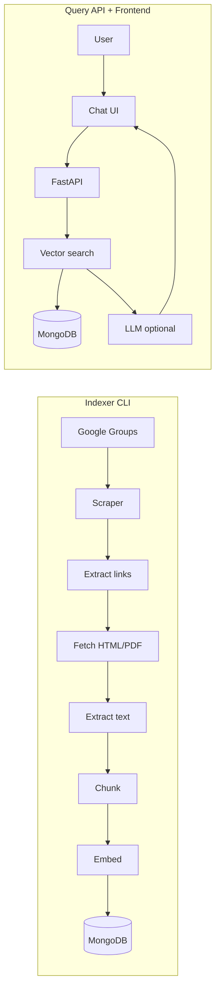

# Mailing List Archive Search Web App – Implementation Plan

## Context and constraints

- **Data source**: [CoRE stack: NRM](https://groups.google.com/g/core-stack-nrm/) – public Google Group; no official API for message content. Fetching will rely on **web scraping** (and optionally MBOX if you later add a pipeline that uses `gg_scraper` or similar).
- **Workspace**: `archive-search` is effectively empty (only `.venv`). The plan assumes a **new monorepo** under this folder with shared Python packages and a separate frontend app.
- **Indexing scope**: (1) Message subject + body, (2) **Linked content**: URLs in messages → fetch HTML or PDF → extract text → chunk and index with clear provenance (message id, URL).

---

## 1. Repository layout (modules)

Proposed structure:

```
archive-search/
├── README.md
├── pyproject.toml              # Workspace / shared deps; optional: uv or poetry
├── .env.example
├── docs/
│   └── INSTALL.md              # Installation and tooling (see section 6)
├── src/
│   ├── shared/                 # Shared lib: config, DB, embedding, chunking
│   │   ├── __init__.py
│   │   ├── config.py
│   │   ├── db.py               # MongoDB connection and collections
│   │   ├── models.py           # Pydantic/typed models for messages, chunks, sessions
│   │   ├── embeddings.py       # Embedding client (OpenAI or sentence-transformers)
│   │   └── chunking.py         # Text splitter (e.g. RecursiveCharacterTextSplitter)
│   ├── indexer/                # Index preparation CLI
│   │   ├── __init__.py
│   │   ├── __main__.py         # Entry: python -m src.indexer
│   │   ├── cli.py              # Click or argparse CLI
│   │   ├── fetch_groups.py     # Google Groups scraper (paginate topics + messages)
│   │   ├── extract_links.py    # URL extraction from message body; optional allowlist
│   │   ├── fetch_linked.py     # Fetch URL → HTML (trafilatura) or PDF (pymupdf4llm)
│   │   └── index_pipeline.py   # Orchestrate: fetch → link extraction → fetch linked → chunk → embed → upsert
│   └── api/                    # Query API (FastAPI)
│       ├── __init__.py
│       ├── main.py             # FastAPI app, CORS, routers
│       ├── deps.py             # DB and embedding injection
│       ├── routers/
│       │   ├── search.py       # POST /search or /query
│       │   └── sessions.py     # Session create, get, append (conversation history)
│       └── services/
│           ├── search.py       # Embed query, vector search, optional LLM answer
│           └── session_store.py # In-memory or Redis session store
├── frontend/                   # Chat UI (see section 5)
│   ├── package.json
│   ├── index.html
│   ├── src/
│   │   ├── main.ts or App.tsx
│   │   ├── api.ts              # Call FastAPI search + session endpoints
│   │   └── components/        # Chat panel, message list, input
│   └── ...
└── scripts/                    # Optional: one-off or dev scripts
    └── create_vector_index.js  # MongoDB Atlas vector index definition (if not done in code)
```

- **shared**: Used by both **indexer** and **api** (config, MongoDB, embeddings, chunking).
- **indexer**: CLI-only; no web server. Reads last-update state from DB or a small state file, fetches new messages, enriches with linked content, chunks, embeds, upserts into MongoDB.
- **api**: FastAPI app; exposes search and session endpoints; runs the vector search and optional LLM step.
- **frontend**: Standalone SPA that talks to the API; can be Vue/React/vanilla TS.

---

## 2. Index preparation CLI (build and update index)

**Responsibilities**

- Fetch messages from the Google Group since “last update” (stored in MongoDB or a JSON file, e.g. `last_seen_message_id` / `last_seen_timestamp`).
- Extract links from each message body (regex or HTML parsing).
- Optionally filter links (allowlist of domains: e.g. `sciencedirect.com`, `nature.com`, `arxiv.org`, `medium.com`, `*.pdf`) to avoid indexing arbitrary sites.
- For each link: fetch content; if HTML → use **trafilatura**; if PDF → use **pymupdf4llm** (or PyMuPDF) to get text.
- Chunk message bodies and linked-document text (e.g. **LangChain** `RecursiveCharacterTextSplitter` with overlap), attach metadata: `source_type` (message | linked_page), `message_id`, `url`, `title`, etc.
- Generate embeddings for each chunk (via **shared** embedding module).
- Upsert into MongoDB: one collection for **raw messages** (and optionally raw linked docs), one for **chunks** with an **embedding** field for vector search.

**Google Groups fetching**

- No public API. Use a **custom scraper**:
  - Base URL: `https://groups.google.com/g/core-stack-nrm/`.
  - List topic threads (e.g. topic list page), then for each thread load the thread page and parse message blocks (author, date, body).
  - Prefer **httpx** + **BeautifulSoup** first; if the group uses heavy JavaScript, add **Playwright** (or Selenium) to render and then parse HTML.
- Persist “last update” (e.g. newest message id or timestamp seen) so the next run only fetches **new** messages.
- Optional: support **full rebuild** (ignore “last update”, re-fetch all) via a CLI flag.

**CLI interface (example)**

- `python -m src.indexer update` – incremental update (fetch new messages since last run, fetch new linked content, re-chunk and re-embed only new/changed items).
- `python -m src.indexer build --full` – full rebuild.
- Options: `--group-url`, `--skip-linked`, `--limit N` (for testing).

**Dependencies (indexer + shared)**

- `httpx`, `beautifulsoup4`, `trafilatura`, `pymupdf4llm` (or `pymupdf`), `langchain-text-splitters`, `pymongo`, `openai` or `sentence-transformers`, `python-dotenv`, `click` or `argparse`.

---

## 3. Database (MongoDB) and vector index

- **Collections** (names are configurable in `shared.config`):
  - **messages**: `message_id`, `thread_id`, `author`, `subject`, `body`, `date`, `url`, `links[]`, `updated_at`.
  - **linked_docs**: `url`, `title`, `content_type` (html|pdf), `raw_text`, `message_ids[]`, `fetched_at`.
  - **chunks**: `chunk_id`, `text`, `embedding` (array of floats), `source_type`, `message_id`, `linked_url`, `metadata` (e.g. title, chunk_index).
- **Vector index**: Create a **vectorSearch** index on `chunks.embedding` (MongoDB Atlas or MongoDB 6+ with vector search). Dimension must match the embedding model (e.g. 1536 for OpenAI `text-embedding-3-small`, or 384 for `all-MiniLM-L6-v2`). Index creation can be done in code (e.g. in indexer or API startup) or via a one-off script.

**Incremental update strategy**

- Store `last_updated` (or last message id) in a **state** collection or a small config document.
- When updating: fetch only messages newer than that; for new messages, extract new links, fetch only URLs not already in `linked_docs`, chunk and embed only new/changed content; upsert into `chunks` (keyed by stable id, e.g. `message_id + chunk_index` or hash of content + source).

---

## 4. Query API (FastAPI)

- **Endpoints**:
  - `POST /api/search` (or `/api/query`): body `{ "query": "natural language question", "session_id": "optional" }`. Returns: list of relevant chunks (with metadata: message link, linked URL, snippet) and optionally an **answer** from an LLM using those chunks as context.
  - `POST /api/sessions`: create session; returns `session_id`.
  - `GET /api/sessions/{session_id}`: get conversation history.
  - `POST /api/sessions/{session_id}/messages`: append user/assistant message (for chat history).
- **Flow for `/api/search`**:
  1. Optional: load session and append current query to conversation history.
  2. Embed the query (same model as indexer).
  3. Run **vector search** on `chunks` (e.g. `$vectorSearch` aggregation).
  4. Return top-k chunks; optionally call an LLM with chunks as context to generate an answer; store query and answer in session if `session_id` provided.
- **Session store**: In-memory dict keyed by `session_id` is enough for a single process; for production, use **Redis** or store in MongoDB (e.g. `sessions` collection with `messages[]`).
- **Dependencies**: `fastapi`, `uvicorn`, `pymongo`, shared package (config, db, embeddings).

---

## 5. Frontend chat interface

- **Goal**: Single-page chat UI where the user types a natural language question and sees search results and/or an AI-generated answer.
- **Stack**: Lightweight option – **Vite + Vue 3** or **React** (or vanilla TS) with a simple chat layout (message list + input box). Use **fetch** or **axios** to call FastAPI (e.g. `POST /api/search`, `POST /api/sessions`).
- **Features**: Send query; display loading state; show returned chunks (e.g. expandable cards with source link and snippet) and optional answer; optional session selector or “new chat”; basic error handling and CORS (API must allow frontend origin).

---

## 6. Installation and tooling instructions (for `docs/INSTALL.md`)

**System prerequisites**

- **Python**: 3.11+ (recommended).
- **Node**: 18+ (for frontend build).
- **MongoDB**: 6+ with vector search support (local or [MongoDB Atlas](https://www.mongodb.com/atlas)); Atlas is the easiest for vector search.
- **Optional**: **Playwright** (if using for Google Groups): `playwright install` for browser binaries.
- **Optional (alternative pipeline)**: If using **gg_scraper** and MBOX: `formail` from procmail (e.g. `apt install procmail` on Linux).

**Python setup**

- Create venv: `python -m venv .venv`; activate (e.g. `.venv\Scripts\activate` on Windows).
- Install deps: from repo root, `pip install -e ".[dev]"` if using editable install with `pyproject.toml` and optional dev deps (e.g. pytest, ruff).
- **Environment**: Copy `.env.example` to `.env`; set `MONGODB_URI`, `OPENAI_API_KEY` (if using OpenAI embeddings/LLM), and optional `REDIS_URL` for sessions.

**Embedding model choice**

- **OpenAI**: `OPENAI_API_KEY`; use `text-embedding-3-small` (or `-large`) for indexing and query.
- **Local**: e.g. `sentence-transformers` with `all-MiniLM-L6-v2` – no API key; dimension 384; create vector index with that dimension.

**Running**

- **Indexer (first time or full rebuild)**: `python -m src.indexer build --full`. Incremental: `python -m src.indexer update`.
- **API**: `uvicorn src.api.main:app --reload --host 0.0.0.0 --port 8000`.
- **Frontend**: `cd frontend && npm install && npm run dev` (serve on e.g. 5173); set API base URL to `http://localhost:8000` (or via env).

**MongoDB vector index**

- Document in README or `docs/INSTALL.md`: create a vector search index on the `chunks` collection with field `embedding`, dimensions matching the chosen model, and similarity function (e.g. cosine). Can be done via Atlas UI or a small script that calls `create_search_index` (or equivalent).

---

## 7. Data flow summary




---

## 8. Implementation order (suggested)

1. **Scaffold repo**: `pyproject.toml`, `src/shared` (config, db, models), `.env.example`, and `docs/INSTALL.md` stub.
2. **shared**: Implement `config`, `db` (MongoDB connection, collection accessors), `chunking`, `embeddings`.
3. **indexer**: Implement `fetch_groups` (scraper for CoRE stack NRM), `extract_links`, `fetch_linked` (trafilatura + pymupdf4llm), `index_pipeline`, and CLI (`update` / `build --full`).
4. **MongoDB**: Define collections and create vector index (script or startup).
5. **api**: FastAPI app, `search` and `sessions` routers, vector search in `services/search.py`, session store in `services/session_store.py`.
6. **frontend**: Minimal chat UI calling `/api/search` and `/api/sessions`.
7. **docs/INSTALL.md**: Finalize with all prerequisites, env vars, and run commands.

---

## 9. Risks and mitigations


| Risk                                 | Mitigation                                                                                                            |
| ------------------------------------ | --------------------------------------------------------------------------------------------------------------------- |
| Google Groups HTML structure changes | Encapsulate parsing in `fetch_groups.py`; add tests with saved HTML fixtures; consider Playwright if DOM is JS-heavy. |
| Paywalled or inaccessible links      | Skip on 403/4xx or after timeout; store `fetch_failed` in `linked_docs` to avoid retrying forever.                    |
| Rate limiting / blocking             | Throttle requests; use respectful User-Agent; optional backoff.                                                       |
| Embedding dimension mismatch         | Single config value for dimension; document it next to vector index creation.                                         |


---

## 10. Out of scope for initial plan

- Authentication/authorization (API and UI are open; can add later).
- Scheduled/cron-based index updates (document how to run `python -m src.indexer update` via cron or Task Scheduler).
- Multiple mailing groups (design supports one group URL from config; extend later with multi-group and group filter in search).

This plan gives you a clear repo layout, module boundaries, technology choices, and installation steps so you can implement the indexer CLI, FastAPI query API with sessions, and chat frontend in order.